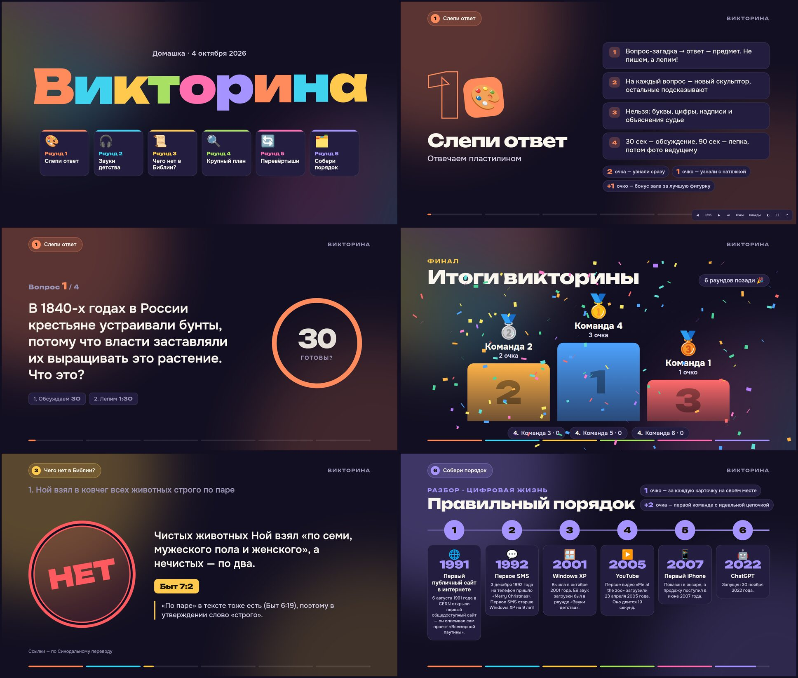

# Викторина · Домашка 04.10.2026

Сайт-презентация для проектора: 6 раундов, таймеры, звуки, галерея фото и табло очков.
Работает **без интернета** и без установки — это обычные HTML-файлы.



## Как запустить

1. Скачать репозиторий: на GitHub **Code → Download ZIP** (или `git clone`), распаковать.
2. Положить звуки и картинки в `assets/` (см. ниже).
3. Открыть `index.html` в **Google Chrome** (двойной клик).
4. Перетащить окно на проектор и нажать **F** — полный экран.

Если что-то не грузится из файла (бывает в некоторых браузерах), запустите маленький сервер
в папке проекта и откройте http://localhost:8000:

```
python3 -m http.server 8000
```

## Управление

| Клавиша | Что делает |
|---|---|
| **→**, **Пробел**, **PgDn** | Дальше. На слайдах с таймером первое нажатие запускает таймер (или звук), второе — переход дальше |
| **←**, **PgUp** | Назад |
| **P** | Пауза / продолжить таймер |
| **R** | Перезапустить таймер |
| **S** | Очки команд: начислить, переименовать, добавить или удалить команду |
| **O** | Список всех слайдов, переход в любое место, **запасные вопросы** раунда 1 |
| **F** | Полный экран |
| **T** | Светлая / тёмная тема (светлая — для светлого зала) |
| **B** | Чёрный экран |
| **M** | Выключить / включить сигналы таймера |
| **H** | Подсказка по клавишам |

Пульт-презентер работает (он нажимает PgUp / PgDn). Клавиши работают и в русской раскладке.
При движении мышью в правом нижнем углу появляются кнопки ведущего.

Очки и названия команд сохраняются в браузере — после перезагрузки страницы ничего не пропадёт.
Сайт также запоминает, на каком слайде вы остановились.

## Что положить в `assets/`

### Раунд 2 «Звуки детства» → `assets/sounds/`

| Файл | Звук |
|---|---|
| `01_nokia.mp3` | мелодия Nokia |
| `02_eralash.mp3` | заставка «Ералаш» |
| `03_mario.mp3` | тема Super Mario |
| `04_windows_xp.mp3` | загрузка Windows XP |
| `05_millioner.mp3` | музыка вопроса «Кто хочет стать миллионером?» |
| `06_fruit_ninja.mp3` | Fruit Ninja |
| `07_diskovyi_telefon.mp3` | набор номера на дисковом телефоне |
| `08_tetris.mp3` | Тетрис («Коробейники») |
| `09_signaly_vremeni.mp3` | сигналы точного времени |

Для звуков 1, 7, 8 и 9 есть **встроенная замена**: если файла нет, сайт сыграет синтезированную
версию сам. Для остальных файл обязателен — без него на слайде появится красная подпись «Нет файла».
Длина отрывка задаётся в `js/data.js` (поле `clip`, в секундах).

### Раунд 4 «Крупный план» → `assets/closeup/`

Слайды из архива `krupny_plan_slides.zip`: `01_film_1.jpg … 01_film_4.jpg`, `02_oreo_1…4`,
`03_sim_1…4`, `04_teabag_1…4`, `05_pick_1…4`, `06_vhs_1…4`, `07_apple_1…4`.
Подходят `.jpg`, `.png`, `.jpeg` и `.webp`. `_1` — макро, `_2` — фрагмент, `_3` — целиком, `_4` — с подписью.
Пока картинок нет, вместо них показывается размытая эмодзи-заглушка.

## Как проходят раунды на сайте

1. **Слепи ответ.** Вопрос → таймер 30 сек обсуждения и сразу 90 сек лепки → галерея: перетащите
   фото фигурок на карточки команд (или нажмите на карточку и выберите файл, или Ctrl+V) →
   правильный ответ. Клик по фото — на весь экран. В конце раунда — бонус-слайд со всеми фигурками.
   Фото живут, пока открыта страница.
2. **Звуки детства.** Первое нажатие проигрывает звук два раза с паузой и запускает 10 сек на запись.
   Потом разбор: ответ и кнопка «Послушать ещё раз» (или →).
3. **Чего нет в Библии?** Утверждение + 15 сек → на экране «3-2-1 · Таблички!» → ответ с цитатой.
4. **Крупный план.** Первое нажатие запускает таймер; через 15 сек картинка сама отдаляется
   (этапы 3 → 2 → 1 очко). Нажатие → переключает этап досрочно.
5. **Перевёртыши.** Загадка + 20 сек → оригинал и разбор слов.
6. **Собери порядок.** Таймер 90 сек → «Стоп!» → цепочка открывается по одной карточке.

После каждого раунда — табло. Финал: пьедестал открывается с 3-го места к 1-му, с конфетти.

## Как поменять тексты

Все вопросы, ответы и правила — в файле `js/data.js`. Его можно редактировать прямо на GitHub.

## Устройство

- `index.html` — страница
- `css/style.css` — дизайн (цвета раундов — в начале файла)
- `js/data.js` — содержимое викторины
- `js/app.js` — слайды, навигация, таймеры, очки
- `js/sound.js` — звуки и сигналы
- `assets/fonts/` — шрифты Unbounded и Onest (лицензия SIL OFL)
